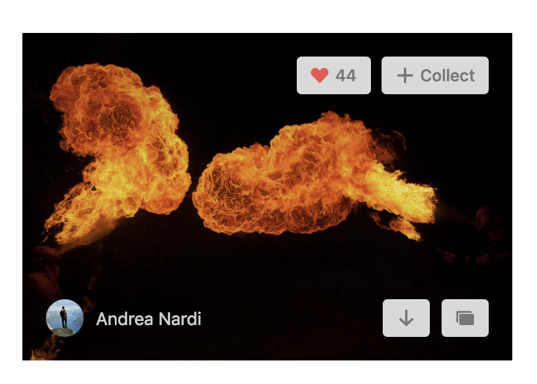
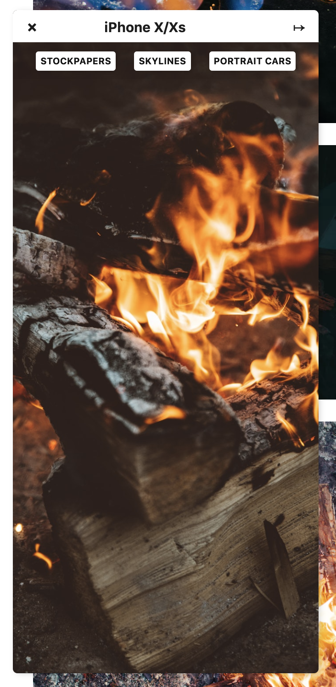
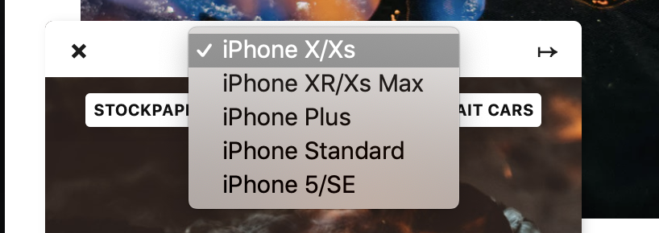
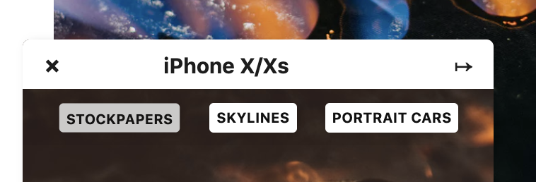

# Unsplash Utility

  This extension let's you preview Unsplash('s) photos as iPhone wallpapers.

---

> A custom button is rendered near the download button, this is used to select a photo.

> After you've selected a photo, a frame will appear on the left side of the page

> Preview on multiple screen sizes

> You can add up to 3 collections to quick add selected photo

## Installation
Until release on the Chrome webstore, you can install the extension by following the instructions below:

- Clone the repo or download the latest release.
- Go to [chrome://extensions](chrome://extensions) and click on "Load unpacked extension"
- Navigate to the repo folder and press enter

## Authors
- [Federico Vitale](https://rawnly.com)
